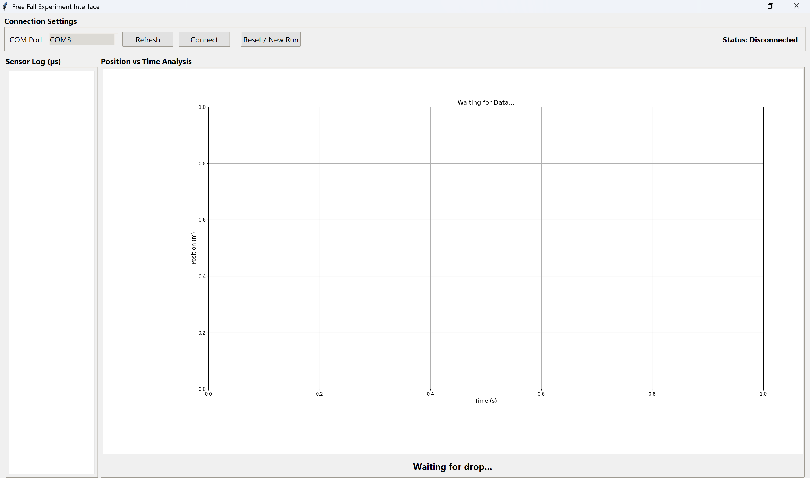
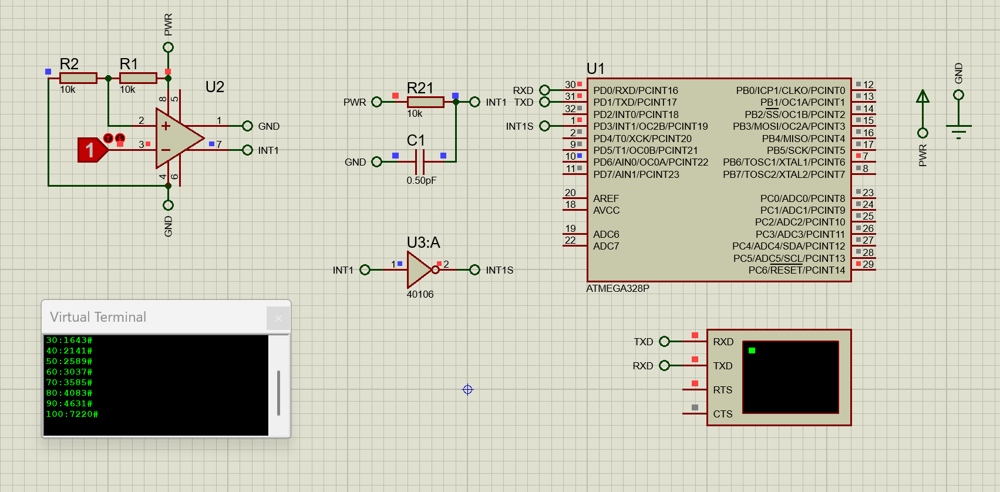

# 🍎 Free Fall Experiment Module with Arduino & Python


## 📖 Overview
This project is an automated system designed to calculate the gravitational acceleration constant ($g$) with high precision. It consists of an Embedded Firmware module (Arduino Nano) that controls an electromagnet and captures sensor timing, and a Desktop GUI(Python) that visualizes the drop data in real-time and performs curve fitting to determine gravity.

The system replaces manual stopwatches with microsecond-level timing using direct AVR Timer1 register manipulation.

## 🚀 Features
* **Precision Timing:** Uses ATmega328P **Timer1 (16-bit)** with direct register access (ISR) for microsecond accuracy.
* **Automated Control:** Electromagnet release is triggered via Serial command.
* **Real-time Dashboard:** Python (Tkinter) application displays sensor logs and plots Position vs. Time.
* **Data Analysis:** Automatic curve fitting using `scipy.optimize` to calculate $g$.
* **Simulation Ready:** Full support for Proteus simulation.

## 📸 Screenshots

Python Interface


Proteus Simulation


## 🛠️ Hardware & Pinout

**Microcontroller:** Arduino Nano (ATmega328P)

| Component | Pin Name | Arduino Pin | Description |
| :--- | :--- | :--- | :--- |
| **Magnet** | PD6 | D6 | Controls the electromagnet (Active LOW/HIGH configured in code) |
| **Sensors** | PD3 / INT1 | D3 | Connected to Sensor Array (Falling Edge Trigger) |
| **Serial RX** | PD0 | RX | USB Communication |
| **Serial TX** | PD1 | TX | USB Communication |

## 💻 Tech Stack
* **Firmware:** C++ (PlatformIO / AVR-GCC)
* **Desktop App:** Python 3.10+
    * `tkinter` (UI)
    * `matplotlib` (Graphing)
    * `scipy` & `numpy` (Physics Math)
    * `pyserial` (Communication)
* **Simulation:** Proteus 8 Professional

## ⚙️ Installation & Usage

### 1. Firmware (PlatformIO)
1.  Open the project folder in **VS Code**.
2.  Ensure **PlatformIO** extension is installed.
3.  Connect your Arduino Nano.
4.  Click the **PlatformIO: Upload** button (Arrow icon).

### 2. Python Application
Ensure you have Python installed, then install the dependencies:
```bash
pip install numpy matplotlib scipy pyserial